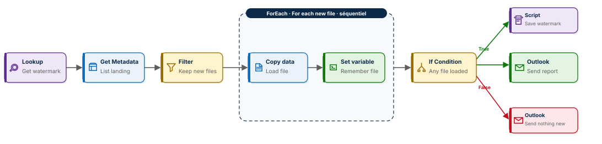
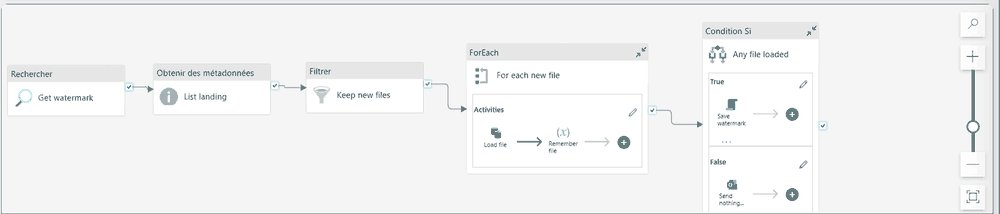
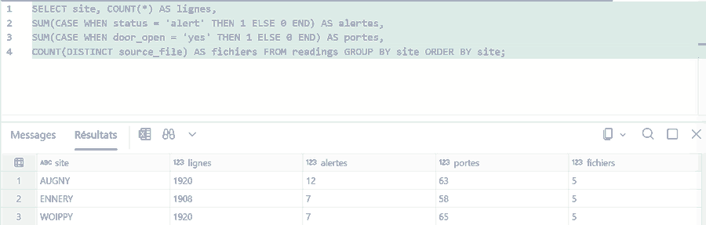

# 🧠 Fabric Pipeline Express 3 : lister, filtrer, charger, mémoriser

Un pipeline Microsoft Fabric Data Factory qui se souvient de ce qu'il a déjà chargé. Il lit son filigrane dans un entrepôt, liste le dossier d'arrivée, ne garde que les fichiers nouveaux, les charge un par un, puis note le dernier fichier traité. Relancé dix fois sans nouveau fichier, il ne recharge rien et vous l'écrit. Dix activités, neuf types d'activité, aucune ligne de code, aucune date en paramètre.

**Guide PDF de 7 pages inclus** : [`Pipeline_Fabric_Guide_3_public.pdf`](Pipeline_Fabric_Guide_3_public.pdf). Chaque activité, chaque champ, chaque expression, et les chiffres à retrouver à l'unité près.



## 📸 Aperçu

Le pipeline tel qu'il apparaît dans Fabric, puis la vérification dans le point de terminaison SQL du lakehouse après la troisième exécution.





## 🎯 Résultats clés

| Indicateur | Valeur |
|---|---|
| Activités dans le pipeline | 10 (Lookup, Get Metadata, Filter, ForEach, Copy data, Set variable, If Condition, Script, Office 365 Outlook ×2) |
| Lignes de code | 0 |
| Paramètres à saisir pour exécuter | 0, le pipeline sait seul où il s'est arrêté |
| Fichiers déposés sur cinq journées | 5, chargés en deux exécutions |
| Fichiers relus deux fois | 0 |
| Lignes dans la table `readings` après la dernière exécution | 5 748 |
| Relances sans nouveau fichier | 2, table et filigrane inchangés |
| Relevés hors plage détectés | 26 sur 5 748 (0,45 %) |

## 💼 Impact métier

Trois entrepôts frigorifiques, Woippy, Ennery et Augny, relèvent la température de leurs zones frais et surgelés toutes les trente minutes. Chaque jour, un fichier arrive dans le lakehouse. Personne ne doit dire au pipeline quel fichier charger : il compare le dossier à sa propre mémoire et ne touche qu'au nouveau. Une relance ne crée jamais de doublon, un fichier dont le chargement échoue est repris automatiquement à l'exécution suivante, et la table `readings` reste exploitable à tout moment pour compter les relevés hors plage par site.

## 📝 Résumé

Le pipeline `PL_ColdChain_Express` commence par un Lookup sur l'entrepôt `WH_Control`, qui renvoie le nom du dernier fichier chargé. Un Get Metadata liste le dossier `Files/landing` du lakehouse. Une activité Filter ne garde que les `.csv` dont le nom dépasse ce filigrane. Un ForEach séquentiel parcourt les fichiers retenus : pour chacun, un Copy ajoute les lignes à la table `readings` avec la colonne `source_file`, puis un Set variable mémorise le nom du fichier. Après la boucle, une If Condition teste si quelque chose a été chargé. Branche True : un Script écrit le nouveau filigrane dans l'entrepôt et un e-mail donne le bilan. Branche False : un e-mail dit qu'il n'y avait rien de nouveau.

## 🔁 Pipeline

| Activité | Type | Rôle |
|---|---|---|
| `Get watermark` | Lookup | `SELECT last_file FROM dbo.watermark WHERE pipeline = 'PL_ColdChain_Express'` sur l'entrepôt |
| `List landing` | Get Metadata | Éléments enfants du dossier `Files/landing` |
| `Keep new files` | Filter | `@and(endswith(item().name, '.csv'), greater(item().name, activity('Get watermark').output.firstRow.last_file))` |
| `For each new file` | ForEach, séquentiel | Parcourt `@activity('Keep new files').output.Value` |
| `Load file` | Copy data | `landing/@{item().name}` vers la table `readings`, action Ajouter, colonne `source_file` |
| `Remember file` | Set variable | `last_file` = `@item().name`, après le Copy et non avant |
| `Any file loaded` | If Condition | `@not(empty(variables('last_file')))` |
| `Save watermark` | Script, branche True | `UPDATE dbo.watermark SET last_file = '@{variables('last_file')}', updated_at = GETDATE() WHERE pipeline = 'PL_ColdChain_Express'` |
| `Send report` / `Send nothing new` | Office 365 Outlook | Le bilan en True, « aucun nouveau fichier » en False |

## 🧠 Le filigrane expliqué

Un filigrane est la trace que le pipeline laisse derrière lui pour savoir où reprendre. Ici, c'est une seule ligne dans une table d'entrepôt :

```
pipeline               last_file                 updated_at
PL_ColdChain_Express   readings_2026-10-08.csv   2026-10-08 18:42:11
```

Comparer des noms de fichiers suffit parce que les noms portent la date au format `AAAA-MM-JJ` : `readings_2026-10-07.csv` est plus grand que `readings_2026-10-06.csv`, et le Filter n'a besoin que de cette comparaison. L'entrepôt est présent pour une seule raison : un lakehouse se lit très bien en SQL depuis un pipeline, mais ne s'écrit pas. L'entrepôt accepte un `UPDATE`, et c'est exactement ce qu'il faut pour une mémoire d'une ligne.

## 🛡️ Reprise après échec

L'ordre des deux activités de la boucle est le mécanisme de reprise du pipeline. `Remember file` est relié derrière `Load file` : si le Copy échoue, la variable ne prend pas ce nom, le fil vert s'arrête, le filigrane n'est pas avancé. À l'exécution suivante, le fichier fautif est encore postérieur au filigrane et il est repris. Rien à coder, rien à surveiller.

## 🧬 Traçabilité

```
WH_Control / dbo.watermark                       last_file = readings_2026-10-06.csv
   │  Lookup Get watermark
   ▼
LH_ColdChain / Files / landing                   readings_2026-10-04 … 08.csv
   │  Get Metadata List landing      5 fichiers
   │  Filter Keep new files          2 fichiers postérieurs au filigrane
   ▼
ForEach For each new file (séquentiel)
   │  Copy data Load file            Append dans Tables / readings + colonne source_file
   │  Set variable Remember file     last_file = nom du fichier
   ▼
If Condition Any file loaded
   ├──True──▶ Script Save watermark  UPDATE dbo.watermark … readings_2026-10-08.csv
   │          Outlook Send report
   └──False─▶ Outlook Send nothing new
```

## 🏗️ Architecture

Un lakehouse `LH_ColdChain` pour les données, un entrepôt `WH_Control` pour la mémoire. Trois principes structurent le projet :

1. **Un filigrane, pas un paramètre** : le pipeline lit où il s'est arrêté et l'écrit en finissant. Personne ne lui dit quoi charger.
2. **Filtrer avant de boucler** : le dossier est listé en entier, le Filter ne laisse passer que le nouveau, la boucle ne voit jamais un fichier déjà chargé.
3. **Mémoriser seulement sur preuve** : la variable n'est renseignée qu'après un Copy réussi, et le filigrane n'est écrit que si la variable n'est pas vide.

## ▶️ Les quatre exécutions

| Exécution | Dossier `landing` | Ce qui se passe | Table `readings` | Filigrane |
|---|---|---|---|---|
| 1 | 3 fichiers | 3 retenus, 1 152 + 1 152 + 1 140 lignes, e-mail de bilan | 3 444 | `readings_2026-10-06.csv` |
| 2 | 3 fichiers | 0 retenu, boucle à vide, e-mail « aucun nouveau fichier » | 3 444 | inchangé |
| 3 | 5 fichiers | 2 retenus, 1 152 + 1 152 lignes, e-mail de bilan | 5 748 | `readings_2026-10-08.csv` |
| 4 | 5 fichiers | 0 retenu, e-mail « aucun nouveau fichier » | 5 748 | inchangé |

## 📦 Jeu de données

```
data/
├── readings_2026-10-04.csv   1 152 lignes, 2 alertes
├── readings_2026-10-05.csv   1 152 lignes, 11 alertes
├── readings_2026-10-06.csv   1 140 lignes, 0 alerte, un capteur muet six heures
├── readings_2026-10-07.csv   1 152 lignes, 6 alertes
└── readings_2026-10-08.csv   1 152 lignes, 7 alertes
```

Vingt-quatre capteurs (3 sites × 2 zones × 4 capteurs), un relevé toutes les trente minutes. Neuf colonnes : `reading_id`, `reading_time`, `site`, `zone`, `sensor_id`, `temperature_c`, `humidity_pct`, `door_open`, `status`. Une alerte est un relevé hors plage : au-dessus de 4 °C en frais, au-dessus de −18 °C en surgelés. Données fictives, conçues pour l'exercice.

## 🚀 Reproduire l'exercice

1. Créer un lakehouse `LH_ColdChain`, un dossier `Files/landing`, et y déposer les fichiers du 4, 5 et 6 octobre seulement.
2. Créer un entrepôt `WH_Control` et exécuter :

```sql
CREATE TABLE dbo.watermark (
  pipeline   VARCHAR(100) NOT NULL,
  last_file  VARCHAR(200) NOT NULL,
  updated_at DATETIME2(6) NOT NULL);
INSERT INTO dbo.watermark VALUES ('PL_ColdChain_Express', '', GETDATE());
```

3. Construire `PL_ColdChain_Express` en suivant `Pipeline_Fabric_Guide_3_public.pdf`.
4. Exécuter deux fois, déposer les fichiers du 7 et du 8 octobre, exécuter deux fois encore, et retrouver les chiffres du tableau ci-dessus.
5. Vérifier dans le point de terminaison SQL :

```sql
SELECT site, COUNT(*) AS lignes,
       SUM(CASE WHEN status = 'alert' THEN 1 ELSE 0 END)  AS alertes,
       SUM(CASE WHEN door_open = 'yes' THEN 1 ELSE 0 END) AS portes,
       COUNT(DISTINCT source_file)                        AS fichiers
FROM readings GROUP BY site ORDER BY site;
```

| site | lignes | alertes | portes | fichiers |
|---|---|---|---|---|
| AUGNY | 1 920 | 12 | 63 | 5 |
| ENNERY | 1 908 | 7 | 58 | 5 |
| WOIPPY | 1 920 | 7 | 65 | 5 |

## 🧰 Stack technique

Microsoft Fabric Data Factory · Lakehouse et Delta Lake · Warehouse · Office 365 Outlook · Point de terminaison SQL

## ✅ Conclusion

Le chargement incrémental n'a pas besoin d'un cadre complexe. Une table d'une ligne, un Filter sur les noms, un Set variable placé au bon endroit : le pipeline sait ce qu'il a fait, reprend seul ce qui a échoué, et ne relit jamais un fichier.

## 💭 Dernier mot

Un bon pipeline ne demande pas quoi faire. Il regarde ce qu'il a déjà fait, et il fait le reste.

---

Abdoul Hamid Diallo · Microsoft Data & AI Engineer · Microsoft Certified DP-600, DP-700, PL-300, AI-102, DP-100, AI-900, DP-900 · [LinkedIn](https://www.linkedin.com/in/abdoul-hamid-diallo-fabric-data-engineer/)
